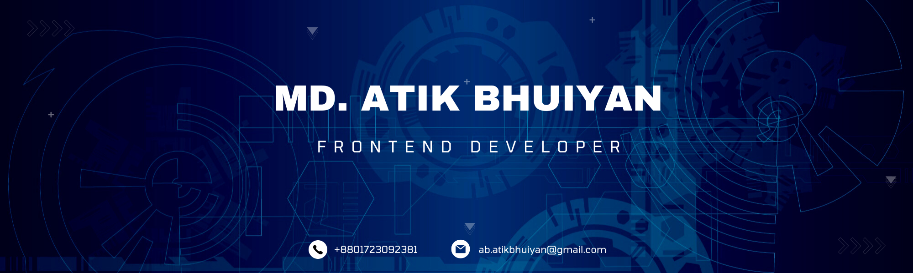

<!-- ### Hi there 👋
# I am Md. Atik Bhuiyan 

- 🌱 I’m currently learning web Development
- 👯 I’m looking to collaborate with other open source project
- 🥅 2021 Goals: React, Node, Mongo, Next.js, Express, Socket IO
- ⚡ Fun fact: I love to explore the world

### Connect with me:

### Languages and Tools:

 
 
 

 -->

<!-- new -->

 

### Hi there 👋
# I'm Md. Atik Bhuiyan 

I'm a frontend developer with a passion for React, dedicated to shaping dynamic and seamless web experiences. Constantly evolving, I am committed to continuous learning and innovation in the ever-changing landscape of web development.

<!-- - 🚀 **Current Focus:** I am currently exploring and mastering the intricacies of React to elevate my skills and create compelling user interfaces. -->

- 🌱 I’m currently exploring and mastering the intricacies of React to elevate my skills and create compelling user interfaces.
- 👯 I’m looking to collaborate with other open source project
- 🚀 2024 Goals: Socket IO, Open CV
- ⚡ Fun fact: I love to explore the world

<!-- - 💻 **Tech Stack:** My toolkit includes React, JavaScript, HTML, and CSS. I believe in the power of clean code and am committed to staying current with industry best practices. -->

<!-- ✨ **Let's Code:** Happy coding! 🚀 -->

### Connect with me:

 
 

# Technologies That I Know

  

 

# Current Status:

  
  

 

# Overall Status:

 

 

